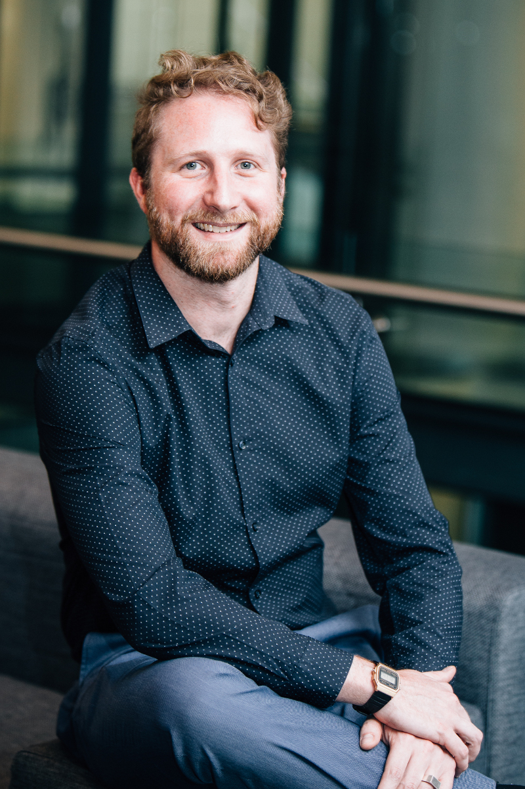

<h4>Hi, I'm Richard Roché but please call me Rick.</h4>

From trying to make games in [BASIC](https://en.wikipedia.org/wiki/BASIC) as a child and making my way through the blue and yellow of [Turbo Pascal](https://en.wikipedia.org/wiki/Turbo_Pascal) in high school; programming has long been a love of mine.

Graduating with a bachelors degree in electronic engineering I spent the initial years of my career designing circuits, writing embedded software in C & C++ and building thick clients in Java and Python; mainly in the mining sector. 

Following on from this, with a move into the financial sector, I have since designed, built and deployed distributed systems using a number of languages (Java, Go, C#, Javascript / Typescript) leveraging a range of technologies, most recently Kubernetes (including deploying and managing clusters on-premise to facilitate cloud migrations) and the Azure ecosystem.

I see myself as a full-stack engineer with a focus on distributed systems, back-end architectures and cloud native infrastructure. I love to be involved in solutions from initial design to feedback loops from systems running in production. I love being part of a high energy team that thrives on crushing it while delivering holistic, client-centric solutions.

Outside of software you will find me outdoors - hiking or having a braai. I love travelling (especially by train), reading, watching live music and eating anything I haven't tried before. I would also love to go to space one day.

