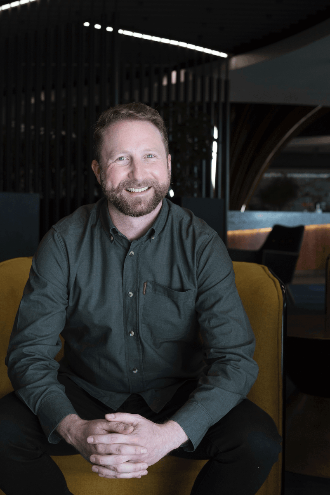

<h4>Hi, I'm Richard Roché but please call me Rick.</h4>

From trying to make games in [BASIC](https://en.wikipedia.org/wiki/BASIC) as a child and making my way through the blue and yellow of [Turbo Pascal](https://en.wikipedia.org/wiki/Turbo_Pascal) in high school; programming has long been a love of mine.

Graduating with a bachelors degree in electronic engineering I spent the initial years of my career designing circuits, writing embedded software in [C](<https://en.wikipedia.org/wiki/C_(programming_language)>) & [C++](https://en.wikipedia.org/wiki/C%2B%2B) and building thick clients in [Java](<https://en.wikipedia.org/wiki/Java_(programming_language)>) and [Python](https://www.python.org/); mainly in the mining sector.

Following on from this, with a move into the financial sector, I have since designed, built and deployed distributed systems using a number of languages (Java, [Go](https://golang.org/), [C#](<https://en.wikipedia.org/wiki/C_Sharp_(programming_language)>), [Javascript](https://en.wikipedia.org/wiki/JavaScript) / [Typescript](https://en.wikipedia.org/wiki/TypeScript)) leveraging a range of technologies, most recently [Kubernetes](https://kubernetes.io/) (including deploying and managing clusters on-premise to facilitate cloud migrations) and the [Azure](https://azure.microsoft.com/) ecosystem.

I see myself as a full-stack engineer with a focus on distributed systems, back-end architectures and cloud native infrastructure. I love to be involved in solutions from initial design to feedback loops from systems running in production. I love being part of a high energy team that thrives on crushing it while delivering holistic, client-centric solutions.

Outside of software you will find me outdoors - hiking or having a [braai](https://www.trafalgar.com/real-word/ultimate-guide-south-african-braai/). I love travelling (especially by train), reading, watching live music and eating anything I haven't tried before. I would also love to go to space one day <i class="fa-solid fa-hand-spock"></i>.

