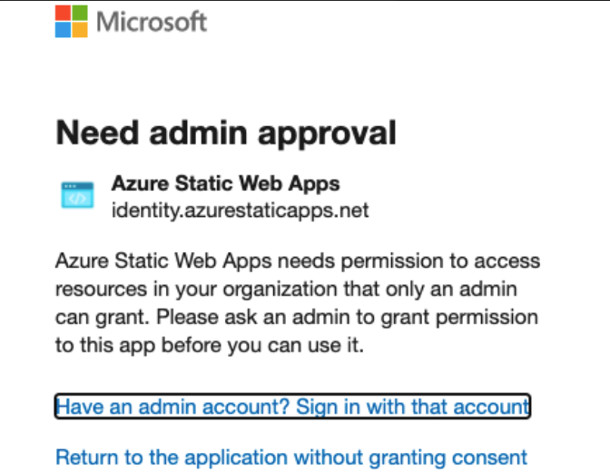
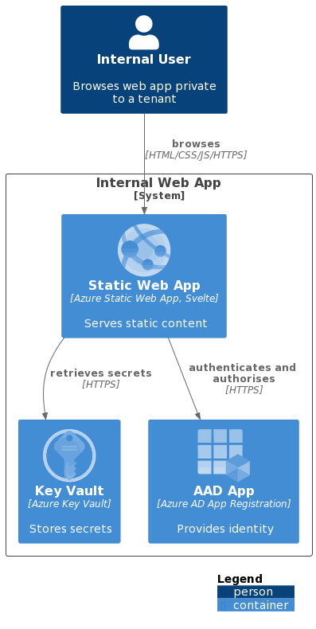
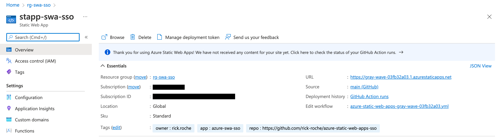
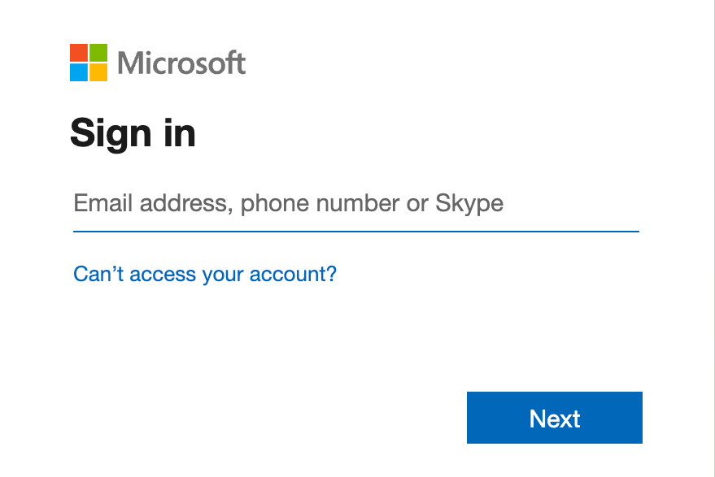
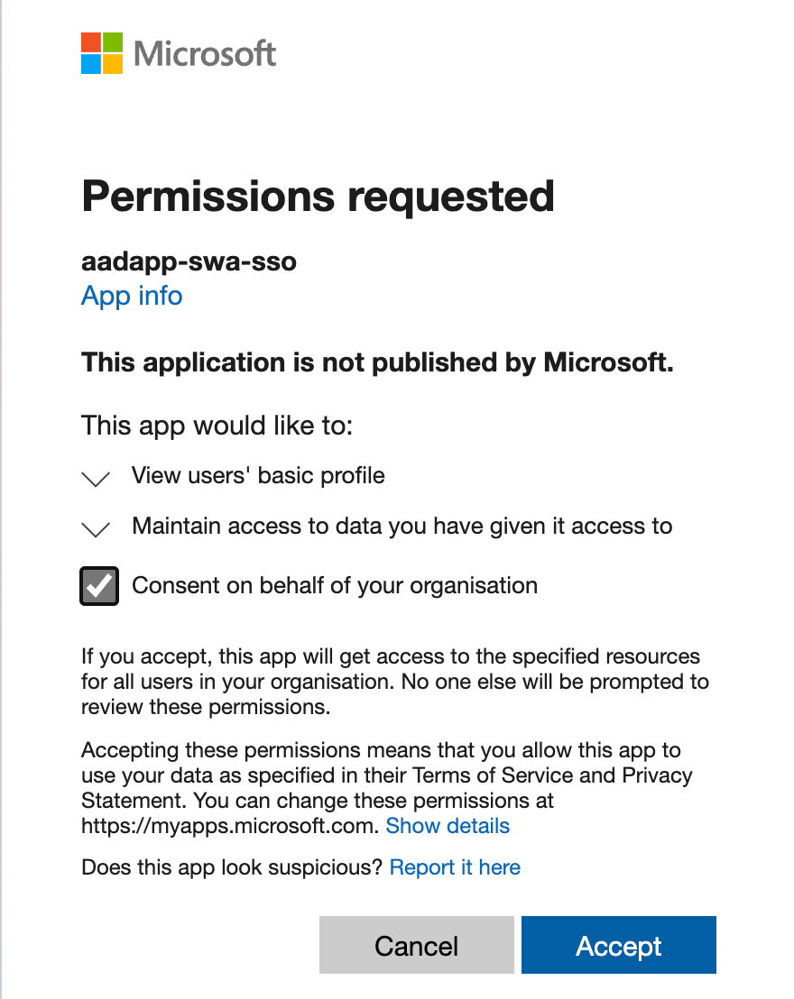
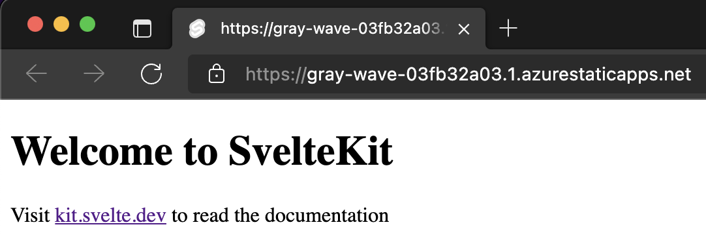

We often build and deploy web applications specifically for users internal to our organisation. [Azure Static Web Apps](https://azure.microsoft.com/en-us/services/app-service/static/) is proving to be an excellent replacement for [Azure App Service](https://azure.microsoft.com/en-us/services/app-service/) in these scenarios.

At a high-level the service provides you with a great set of features (outlined in the [Azure release notes](https://azure.microsoft.com/en-us/updates/azure-static-web-apps-is-now-generally-available/))
> - Globally distributed content for production apps
> - Tailored CI/CD workflows from code to cloud
> - Auto-provisioned preview environments
> - Custom domain configuration and free SSL certificates
> - Built-in access to a variety of authentication providers
> - Route-based authorization
> - Custom routing
> - Integration with serverless APIs powered by Azure Functions
> - A custom Visual Studio Code developer extension
> - A feature-rich CLI for local development

## The desired experience?

The experience I wanted to achieve was that if one of our internal users browsed to any of our internal apps, they would be able to use SSO across them provided they were a member of the AAD group needed to access the app (or just a member of our tenant for organisation-wide apps) - no login button, just a seamless logged-in user experience.

It turns out this was super easy to get right! Follow below!

## Authentication options

Azure Static Web Apps makes authentication easy to enable across the three [pre-configured identity providers](https://docs.microsoft.com/en-us/azure/static-web-apps/authentication-authorization?tabs=invitations)
* Azure Active Directory (AAD)
* Github or
* Twitter

These options allow users to login using a login button linking to the desired provider.

Initially I tried to use the pre-configured AAD provider, and when trying to log in using my company account I was presented with this approval dialogue



Meaning if I was able to get an admin to grant the permission, all users from our tenant would be able to log in to all Azure Static Web Apps, regardless of who had deployed them making this a non-starter for me.

Fortunately we already deploy our static web apps using the Standard plan for [$9/per app/month](https://azure.microsoft.com/en-us/pricing/details/app-service/static/), giving us the ability to use [custom authentication](https://docs.microsoft.com/en-us/azure/static-web-apps/authentication-custom?tabs=aad) and use SSO with our organisations AAD tenant, internal app registrations and restrict access to groups / users in our tenants directory.

## Getting it done!



To achieve the desired experience there are a number of components required
* the static web app (the website)
* an Azure App Registration for your app in your tenant
* an Azure resource group for your project (I'm working on the assumption you already have a subscription, if not [read here](https://docs.microsoft.com/en-us/azure/cost-management-billing/manage/create-subscription))
  * an Azure Static Web App for the web app
  * an Azure Key Vault to safely store the secrets for your app

I will be showing you how to create, configure and deploy these using [GitHub Actions](https://docs.github.com/en/actions), [Bicep](https://docs.microsoft.com/en-us/azure/azure-resource-manager/bicep/overview?tabs=bicep) (for creating the Azure resources) and some once off scripts.


All code is available on GitHub [over here](https://github.com/rick-roche/azure-static-web-apps-sso)



It is a good idea to wire up your Key Vault to a Log Analytics workspace or similar to track audit events when in production.


## Initial setup and deployment

First we are going to scaffold our web app, define our infrastructure and deploy to Azure without any auth in place. Once done, we will move onto the configuration of the app with auth.

### Scaffold the web app

For the purposes of this post, I needed a simple static web app and used the [SvelteKit](https://kit.svelte.dev/) skeleton project with the [static adapter](https://github.com/sveltejs/kit/tree/master/packages/adapter-static).

```bash
npm init svelte@next webapp
cd webapp
npm install --save-dev @sveltejs/adapter-static@next
```

You need to update the default `svelte.config.js` to [use the static adapter](https://github.com/sveltejs/kit/tree/master/packages/adapter-static#usage), see an example [here](https://github.com/rick-roche/azure-static-web-apps-sso/blob/main/webapp/svelte.config.js).

### Define the Azure Infrastructure

#### Resource Group

First, create an Azure resource group. For this tutorial I'm creating it manually from my terminal and [Azure CLI](https://docs.microsoft.com/en-us/cli/azure/)

```bash
az group create -g rg-swa-sso -l northeurope
```

#### Resources
We will be deploying a Static Web App as well as a Key Vault using Bicep. I've split out the Bicep files to make them easier to work with as follows (filenames link to the code on GitHub)

* [`main.bicep`](https://github.com/rick-roche/azure-static-web-apps-sso/blob/main/infra/main.bicep) - the main template that is deployed which makes use of the other templates
* [`get-kv-secrets-refs.bicep`](https://github.com/rick-roche/azure-static-web-apps-sso/blob/main/infra/get-kv-secrets-refs.bicep) - a helper to build up the Key Vault secret references
* [`key-vault.bicep`](https://github.com/rick-roche/azure-static-web-apps-sso/blob/main/infra/key-vault.bicep) - defines the Key Vault resources and the role assignments needed
* [`static-sites.bicep`](https://github.com/rick-roche/azure-static-web-apps-sso/blob/main/infra/static-sites.bicep) - defines the Static Web App resources needed

In the [`main.bicep`](https://github.com/rick-roche/azure-static-web-apps-sso/blob/main/infra/main.bicep) there are the following highlights to make note of

* Configuring the static web app
  * to have app settings that are Key Vault references (`AAD_CLIENT_ID`, `AAD_CLIENT_SECRET`)
  * to use the `Standard` sku

```bicep
module swa 'static-sites.bicep' = {
  name: 'deploy-swa-${appName}'
  params: {
    appSettings: {
      AAD_CLIENT_ID: refs.outputs.aadClientIdRef
      AAD_CLIENT_SECRET: refs.outputs.aadClientSecretRef
    }
    ...
    sku: {
      name: 'Standard'
      tier: 'Standard'
    }
    ...
  }
}
```

* And configuring the key vault to allow the static web app permissions to read from it

```bicep
// https://docs.microsoft.com/en-us/azure/key-vault/general/rbac-guide?tabs=azure-cli#azure-built-in-roles-for-key-vault-data-plane-operations
var keyVaultSecretsUserRole = '4633458b-17de-408a-b874-0445c86b69e6'

module kv 'key-vault.bicep' = {
  name: 'deploy-kv-${appName}'
  params: {
    ...
    roleAssignments: [
      {
        roleDefinitionId: keyVaultSecretsUserRole
        principalType: 'ServicePrincipal'
        principalId: swa.outputs.siteSystemAssignedIdentityId
      }
    ]
    ...
  }
}
```

### Deploy using GitHub

#### Deployment credentials

For a GitHub Action to be able to deploy to your resource group you need to have some form of deployment credentials. You can read about the options available [here](https://docs.microsoft.com/en-us/azure/app-service/deploy-github-actions?tabs=userlevel). I'll be using the [Service Principal](https://docs.microsoft.com/en-us/cli/azure/create-an-azure-service-principal-azure-cli) approach with [Azure CLI](https://docs.microsoft.com/en-us/cli/azure/).

```bash
az ad sp create-for-rbac --name "sp-swa-sso" \
    --role Owner \
    --scopes /subscriptions/{subscription-id}/resourceGroups/{resource-group-name}
    --sdk-auth
```

You will get a JSON output from this that you can then save as a GitHub secret with the name `AZURE_CREDENTIALS`.


* Replace `{subscription-id}` with the ID of your subscription
* Replace `{resource-group-name}` with the name of your resource group
* I've made the service principal have Owner access to the resource group (so that I can assign roles).


#### Workflow token

Azure Static Web Apps needs access to your workflow when deploying. For this we'll set up a `WORKFLOW_TOKEN` secret using a GitHub personal access token with the workflow scope. Follow [the instructions here](https://docs.github.com/en/authentication/keeping-your-account-and-data-secure/creating-a-personal-access-token) to create the token.

#### Github Action Workflow

With the above secrets in place, we can now create a workflow (mines in [`.github/workflows/deploy.yaml`](https://github.com/rick-roche/azure-static-web-apps-sso/blob/6c95cffac91b8d04aefda1921683e03fda5f51bf/.github/workflows/deploy.yaml)) which
* specifies some environment variables for names, tags and locations
* checks out the repo
* logs into Azure using `${{ secrets.AZURE_CREDENTIALS }}`
* deploys to the resource group using the [`azure/CLI@v1` action](https://github.com/marketplace/actions/azure-cli-action)
* gets the API from the deployed static web app (so that we can deploy code to it)
* deploys the webapp using the [`Azure/static-web-apps-deploy@v1` action](https://github.com/Azure/static-web-apps-deploy)

See the full workflow below.

```yaml
name: Deploy Infra and App

on:
  push:
    branches:
      - main
  pull_request:
    types: [opened, synchronize, reopened, closed]
    branches:
      - main

env:
  RESOURCE_GROUP: 'rg-swa-sso'
  RESOURCE_TAGS: '{"owner":"rick.roche", "app":"azure-swa-sso", "repo":"https://github.com/rick-roche/azure-static-web-apps-sso" }'
  APP_NAME: 'swa-sso'
  LOCATION: 'westeurope'

jobs:
  deploy-infra:
    runs-on: ubuntu-latest
    steps:
      - name: Checkout Repository
        uses: actions/checkout@v2

      - uses: actions/setup-node@v2
        with:
          node-version: '16'

      - name: Azure Login
        uses: azure/login@v1
        with:
          creds: ${{ secrets.AZURE_CREDENTIALS }}

      - name: Deploy Infra
        id: deploy_infra
        if: github.event_name != 'pull_request'
        uses: azure/CLI@v1
        with:
          inlineScript: |
            az deployment group create \
              --resource-group ${{ env.RESOURCE_GROUP }} \
              --template-file ./infra/main.bicep \
              --parameters \
                  appName='${{ env.APP_NAME }}' \
                  location='${{ env.LOCATION }}' \
                  repositoryUrl='https://github.com/rick-roche/azure-static-web-apps-sso' \
                  repositoryToken='${{ secrets.WORKFLOW_TOKEN }}' \
                  tags='${{ env.RESOURCE_TAGS }}'

      - name: Get Static Web App API Key
        id: static_web_app_apikey
        if: github.event_name != 'pull_request'
        uses: azure/CLI@v1
        with:
          inlineScript: |
            APIKEY=$(az staticwebapp secrets list --name 'stapp-${{ env.APP_NAME }}' | jq -r '.properties.apiKey')
            echo "::set-output name=APIKEY::$APIKEY"

      - name: Deploy WebApp to Static Web App
        id: static_web_app_deploy
        if: github.event_name != 'pull_request'
        uses: Azure/static-web-apps-deploy@v1
        with:
          azure_static_web_apps_api_token: ${{ steps.static_web_app_apikey.outputs.APIKEY }}
          repo_token: ${{ secrets.GITHUB_TOKEN }} # Used for GitHub integrations (i.e. PR comments)
          action: 'upload'
          # Build configuration for Azure Static Web Apps: https://aka.ms/swaworkflowconfig
          app_location: 'webapp'
          api_location: ''
          output_location: 'build' # relative to app_location
```

## Finalising auth

At this stage you should have a GitHub workflow successfully deploying a Static Web App and a Key Vault to you resource group. You should also be able to browse to your web app using the generated URL (navigate into the Static Web App from the portal, and you will see your URL on the overview tab. e.g. https://gray-wave-03fb32a03.1.azurestaticapps.net).




Your app won't ask you to authenticate just yet!


To enable auth our next steps will be to
* create an AAD app registration
* add it's client ID and secret as secrets in your key vault
* configure the static web app to auto log you in if you aren't already or your token has expired

### AAD App Registration

An AAD app registration allows us to bind our application to a desired set of authentication flows and restrictions. Think of it as giving your application an identity inside AAD. [Mark Foppen wrote a lovely article](https://www.re-mark-able.net/understanding-azure-active-directory-application-registrations/) that may help demystify this a bit.

In this tutorial I'll just be using [Azure CLI](https://docs.microsoft.com/en-us/cli/azure/) to create one:

```bash
az ad app create --display-name aadapp-swa-sso \
    --available-to-other-tenants false \
    --identifier-uris api://stapp-swa-sso \
    --reply-urls 'https://gray-wave-03fb32a03.1.azurestaticapps.net/.auth/login/aad/callback' \
    --native-app false
```


Ensure you set the `--reply-urls` to be the generated URL of your app with the `/.auth/login/aad/callback` suffix. This allows AAD to call your app once the auth flow has completed.


Once created, we need to create an application secret for the application. For this tutorial you can do this via the portal following the [instructions here](https://docs.microsoft.com/en-us/azure/active-directory/develop/howto-create-service-principal-portal#option-2-create-a-new-application-secret).

Copy the value of the secret as well as the `Application (client) ID` of the AAD app (found under the Overview section of the app).

### Setup Key Vault Secrets

Once again, I've used the portal for this tutorial. You can follow the [guide here](https://docs.microsoft.com/en-us/azure/key-vault/secrets/quick-create-portal#add-a-secret-to-key-vault) setting two secrets in your vault
* `aadClientId` - this should be set to the Application (client) ID of your app registration
* `aadClientSecret` - this should be set to the value of the application secret created above

### Configuring the Static Web App

Configuration for Azure Static Web Apps is defined in the [`staticwebapp.config.json`](https://docs.microsoft.com/en-us/azure/static-web-apps/configuration) file, which controls, among other things, authentication and authorisation.

I've put mine in the [root of the webapp folder](https://github.com/rick-roche/azure-static-web-apps-sso/blob/main/webapp/staticwebapp.config.json) and set it to do the following to enable the auto-login SSO magic

* enable custom `auth` with [Azure Active Directory Version 2](https://docs.microsoft.com/en-us/azure/static-web-apps/authentication-custom?tabs=aad#azure-active-directory-version-2) using the app settings references from earlier (`AAD_CLIENT_ID`, `AAD_CLIENT_SECRET`)
  ```json
  "auth": {
    "identityProviders": {
      "azureActiveDirectory": {
        "registration": {
          "openIdIssuer": "https://login.microsoftonline.com/4af290c8-08df-440d-93db-cbac02bd9b19/v2.0",
          "clientIdSettingName": "AAD_CLIENT_ID",
          "clientSecretSettingName": "AAD_CLIENT_SECRET"
        }
      }
    }
  },
  ```

* a [`navigationFallback` route](https://docs.microsoft.com/en-us/azure/static-web-apps/configuration#fallback-routes) to `index.html`
  ```json
  "navigationFallback": {
    "rewrite": "index.html"
  },
  ```

* specific rules for the apps `routes`
  * creates a `/login` route redirecting to AAD allowing anonymous access
    ```json
    {
      "route": "/login",
      "rewrite": "/.auth/login/aad",
      "allowedRoles": ["anonymous", "authenticated"]
    },
    ```

  * [blocks all providers except AAD](https://docs.microsoft.com/en-us/azure/static-web-apps/authentication-authorization?tabs=invitations#block-an-authentication-provider)
    ```json
    {
      "route": "/.auth/login/github",
      "statusCode": 404
    },
    {
      "route": "/.auth/login/twitter",
      "statusCode": 404
    },
    ```

  * creates a `/logout` route redirecting to AAD allowing anonymous access
    ```json
    {
      "route": "/logout",
      "redirect": "/.auth/logout",
      "allowedRoles": ["anonymous", "authenticated"]
    },
    ```

  * enforces auth for all other routes (`/*`)
    ```json
    {
      "route": "/*",
      "allowedRoles": ["authenticated"]
    }
    ```

* sets up a response override that if an unauthenticated user hits a page, they should be redirected to the `/login` route
    ```json
    "responseOverrides": {
      "401": {
        "redirect": "/login",
        "statusCode": 302
      }
    }
    ```

The combination of all of the above means that anyone accessing the site that isn't logged in will be routed to the `/login` route which will ensure that the AAD auth flow is completed!

## Finishing up!

Commit all your outstanding changes, push to GitHub and watch your action deploy... once done, access your web app in the browser, and it should redirect you to login



Initially you will need to provide admin consent for your AD app registration to read the logged-in user details



If all has gone well you should see the default page after login completes



And that's it! Hope you enjoyed this tutorial and that it helps you setup SSO for your Static Web Apps!


A reminder that all code is available on GitHub [over here](https://github.com/rick-roche/azure-static-web-apps-sso)


Featured image background by [Hello I'm Nik](https://unsplash.com/@helloimnik?utm_source=unsplash&utm_medium=referral&utm_content=creditCopyText "Hello I'm Nik") on [Unsplash](https://unsplash.com/s/photos/sign-in?utm_source=unsplash&utm_medium=referral&utm_content=creditCopyText)
